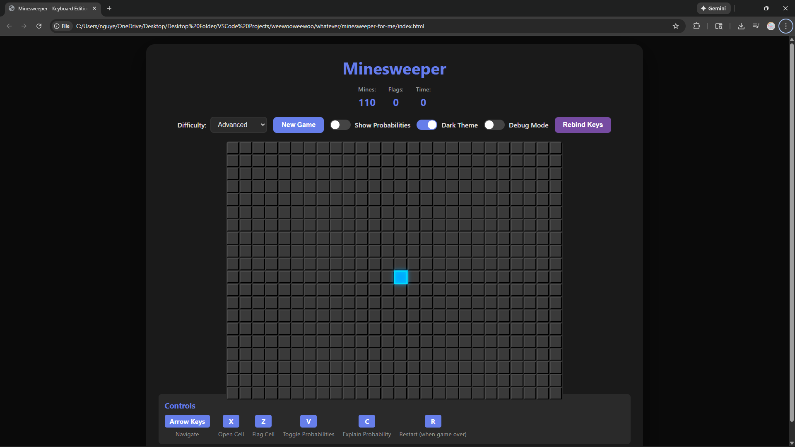
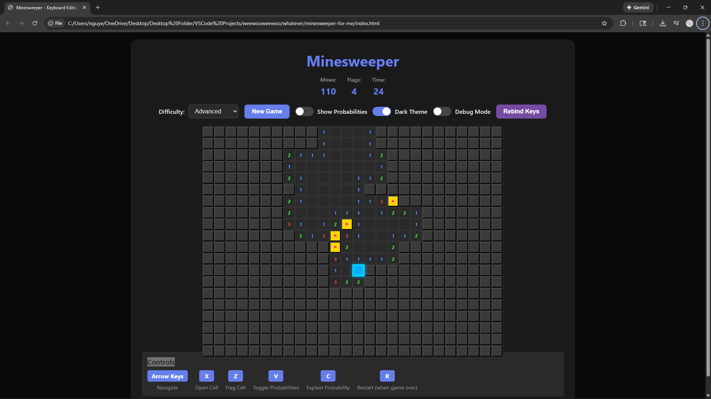
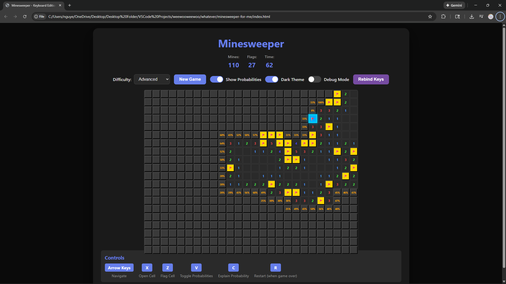

# Minesweeper - Keyboard Edition

A modern, keyboard-controlled Minesweeper game built with vanilla JavaScript, featuring intelligent probability calculations, responsive design, and an enhanced user experience. This project demonstrates advanced game logic, responsive UI design, and real-time probability analysis to help players make informed decisions.

## Features

### Enhanced Gameplay

**Safe First Click System**

- **Built**: Algorithm that excludes the clicked cell and all adjacent cells from mine placement on first click, then automatically reveals a strategic starting area (all safe cells within 2-cell radius)

- **Impact**: Eliminates frustrating luck-based game starts, ensuring every game begins with a logical foundation that players can build upon

**Intelligent Probability Calculation Engine**

- **Built**: Real-time probability analysis system that evaluates multiple revealed cell constraints simultaneously, with weighted averaging and certainty prioritization (0% and 100% take absolute priority)

- **Impact**: Players can make informed decisions based on mathematical analysis rather than guessing, significantly improving win rates and strategic gameplay

**Interactive Probability Explanation Modal**

- **Built**: Dynamic modal popup with arrow pointer that positions near the selected cell, showing detailed constraint breakdowns and calculation logic

- **Impact**: Educational tool that helps players understand probability reasoning, improving their Minesweeper skills while playing

### Keyboard-First Controls

**Full Keyboard Navigation System**

- **Built**: Complete keyboard control scheme with arrow key navigation, customizable keybinds (stored in LocalStorage), and quick action shortcuts

- **Impact**: Enables fast, efficient gameplay without mouse dependency, perfect for accessibility and power users who prefer keyboard workflows

**Quick Restart & Toggle Shortcuts**

- **Built**: 'R' key for instant restart when game over, 'V' key to toggle probability display, 'C' for probability explanations

- **Impact**: Reduces friction in gameplay flow, allowing players to quickly restart or adjust settings without interrupting their rhythm

### Responsive Design

**Mathematical Scaling System**

- **Built**: Advanced calculation algorithm that accounts for scaling gaps (5.7% of cell size), padding, and all UI elements to determine optimal cell size. Formula: `cellSize = availableSpace / (dimensions × 1.057 + 0.057)`

- **Impact**: Board perfectly fits any window size without scrollbars, maintaining full visibility while adapting seamlessly from fullscreen to small windows

**Adaptive Typography**

- **Built**: Dynamic font sizing system with threshold-based scaling (40% for large cells, 45% for medium, 50% for small) that maintains readability across all sizes

- **Impact**: Numbers and probabilities remain legible at any scale, ensuring usability regardless of window size or display resolution

**Theme System with Persistence**

- **Built**: Dark/light theme toggle with LocalStorage persistence and smooth CSS transitions

- **Impact**: Reduces eye strain during extended play sessions and remembers user preference across sessions

### Developer Tools

**Comprehensive Debug Overlay**

- **Built**: Real-time debug panel showing viewport dimensions, board container/element sizes, calculated vs actual dimensions, cell visibility analysis, and game state statistics

- **Impact**: Enables rapid troubleshooting of layout issues and provides transparency into the scaling system's calculations for development and optimization

## Tech Stack

- **Frontend**: Vanilla JavaScript (ES6+), HTML5, CSS3
- **Storage**: LocalStorage for settings persistence
- **Architecture**: Object-oriented design with class-based game logic
- **Styling**: Custom CSS with CSS variables for dynamic theming and responsive scaling

## Getting Started

### Installation

1. Clone the repository:

```bash
git clone https://github.com/yourusername/minesweeper-for-me.git
cd minesweeper-for-me
```

2. Open `index.html` in a modern web browser

No build process or dependencies required - it's ready to play!

### How to Play

- **Arrow Keys**: Navigate the board
- **Z** (default): Open/reveal a cell
- **X** (default): Flag/unflag a cell
- **V**: Toggle probability display
- **C**: Show probability explanation for current cell
- **R**: Restart game (when game over)
- **ESC**: Close modals

### Difficulty Levels

- **Beginner**: 9×9 grid with 10 mines
- **Intermediate**: 16×16 grid with 40 mines
- **Advanced**: 20×26 grid with 110 mines

## Screenshots


*Clean board layout with dark theme*


*Standard gameplay view*


*Gameplay with probability display enabled showing mine likelihood percentages*

### Video Demos

**Gameplay Demo**
- [Watch Gameplay Demo](demos/my-gameplay.mp4)
  *Full gameplay demonstration showing navigation, cell revealing, and probability features*

**Probability Explanation Feature**
- [Watch Probability Explanation Demo](demos/explain-probabilities.mp4)
  *Demonstration of the probability explanation modal with arrow pointer and constraint breakdown*

## Project Highlights

- **Advanced Algorithm**: Sophisticated probability calculation system that analyzes multiple constraints simultaneously
- **Zero Dependencies**: Pure vanilla JavaScript implementation
- **Responsive Architecture**: Mathematical scaling formulas ensure perfect fit at any window size
- **User Experience**: Thoughtful features like safe first click and probability hints enhance gameplay without removing challenge

## License

This project is open source and available under the MIT License.
